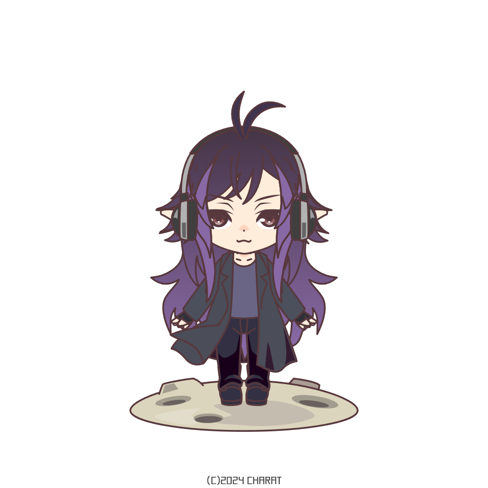

  

  

  

<pre>
-  I'm a Computer Engineering graduate from Bahçeşehir University.
-  Currently focused on learning .NET Web API and related technologies.
-  As for my hobbies, I'm an artist in both traditional and digital mediums.
-  Outside of the coding, you'll often catch me immersed in the gaming.
 
Feel free to reach out through my socials if you share similar interests or have any exciting projects in mind.
  
</pre>

